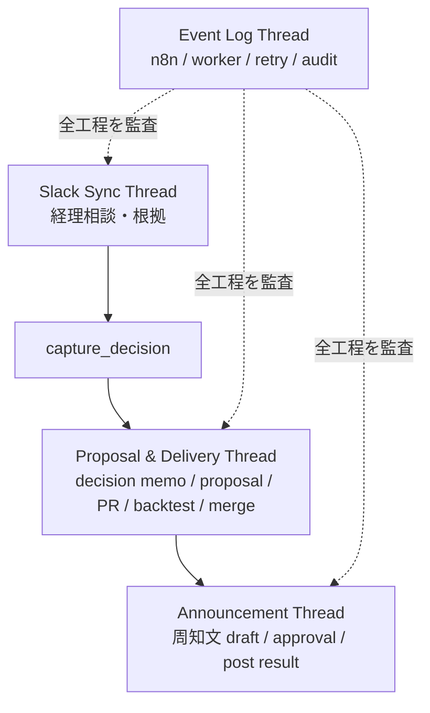

# Thread Experience Map

## 目的

SV が Linear issue を開いたときに、次の 3 つがすぐ分かる状態を作る。

- 今どの phase か
- 誰がボールを持っているか
- SV が次に触るべき thread はどれか

このドキュメントでは、Linear issue 内の thread を「体験」と「イベント」の両方から整理する。

## 基本方針

Linear parent issue は 1 つの delivery unit。
Slack 相談、decision memo、rule proposal、PR、backtest、merge、本番反映確認、周知は、この parent issue に集約する。

ただし、すべてを 1 thread に混ぜない。
SV が読むべき thread と、機械が追記する thread を分ける。

```text
Parent Issue
  ├─ Slack Sync Thread
  ├─ Event Log Thread
  ├─ Proposal & Delivery Thread
  └─ Announcement Thread
```



## Parent Issue / Sub Issue / Thread の関係

Parent issue は SV のホーム画面。
sub issue は phase の進捗表示。
thread は判断と証跡の置き場。

```text
Parent Issue = 1 delivery unit
  status   = current phase
  assignee = current ball owner
  labels   = trigger / resolution / risk

Sub Issues = phase checklist
  Intake
  Accounting Discussion
  Decision Capture
  Rule Draft
  Proposal & Delivery
  Announcement

Threads = context and HITL surface
  Slack Sync
  Event Log
  Proposal & Delivery
  Announcement
```

重要なのは、sub issue を分けても delivery context を分けないこと。
PR / backtest / merge は `Proposal & Delivery` phase の中で進むが、根拠となった proposal と同じ thread に戻す。

## Thread の役割

### Slack Sync Thread

経理 / オペレーターとの会話の source。

役割:

- 問い合わせ本文
- 経理との追加確認
- 合意や判断に至った会話
- Slack permalink / Linear synced thread

SV 体験:

- 普段の会話は Slack で行う
- Linear では、必要なときに根拠確認として読む
- 相談がまとまったら `capture_decision` を置く

やらないこと:

- PR の進行管理
- backtest 結果の置き場
- bot の詳細ログ置き場

### Event Log Thread

機械イベントの監査ログ。

役割:

- n8n が受けたイベント
- local worker が処理したイベント
- marker 検知結果
- agent session id
- エラー / retry / skipped / duplicate

SV 体験:

- 通常は読まない
- 「止まっている理由」を確認するときだけ見る
- local worker / n8n / Linear sync の障害調査に使う

やらないこと:

- SV 承認の主導線
- proposal の議論
- 経理への返答本文

### Proposal & Delivery Thread

ルール変更の中心 thread。
proposal approval 後も閉じず、PR / backtest / CR / merge / 本番反映確認まで同じ thread で管理する。

役割:

- decision memo
- rule proposal
- SV approval / CR / reject
- PR 作成結果
- backtest 結果
- PR review / CR resume の戻り先
- merge 結果
- 本番反映確認

SV 体験:

- 「このルール変更で本当に進めてよいか」を見る
- approve / changes requested / reject を置く
- PR 作成後も、根拠と PR の対応を同じ thread で見る
- issue close 直前まで、この thread を delivery control として見る

やらないこと:

- 経理との長いやり取りの全文
- worker の retry 詳細ログ
- 最終周知文のレビュー

### Announcement Thread

ルール変更を関係者へ伝えるための thread。

役割:

- 周知文 draft
- 投稿先 Slack channel
- SV approval
- Slack 投稿結果
- 周知不要の明示

SV 体験:

- PR merge / 本番反映確認後に見る
- 周知文を承認、修正、または周知不要として close する
- 投稿結果を確認して parent issue を close できる

やらないこと:

- rule proposal の承認
- PR review
- 経理相談そのもの

## Phase と Thread の対応

| Phase | SV が主に見る thread | ボール | 完了条件 |
| --- | --- | --- | --- |
| Intake | Slack Sync / Event Log | agent | Linear issue と Slack sync が作成済み |
| Accounting Discussion | Slack Sync | SV | 経理相談が一旦結論に到達 |
| Decision Capture | Slack Sync / Proposal & Delivery | agent | decision memo が生成済み |
| Rule Draft | Proposal & Delivery | agent | rule proposal が投稿済み |
| Proposal & Delivery | Proposal & Delivery | SV / agent | PR merge と本番反映確認が完了 |
| Announcement | Announcement | SV / agent | 周知投稿または周知不要が記録済み |

## MVP1 の体験フロー

### 1. 問い合わせ開始

SV またはオペレーターが問い合わせ専用 Slack channel にトップレベル投稿する。

生成されるもの:

- Linear parent issue
- phase sub issues
- Event Log Thread
- Slack Sync Thread

SV が見るもの:

- Slack thread
- Linear issue の status / label / assignee

主な event:

```md
[SV_EVENT id=evt_<id> type=slack_inquiry_received status=done source=slack]
[SV_EVENT id=evt_<id> type=linear_issue_bootstrap_completed status=done source=n8n]
```

### 2. 経理相談

SV は Slack thread で経理と会話する。
Linear には公式 sync で会話が蓄積される。

SV が見るもの:

- Slack Sync Thread
- 必要なら Event Log Thread

チェックリスト:

- [ ] 問い合わせの対象 tenant が明確
- [ ] 何が承認 / 差戻し / 要確認なのか明確
- [ ] 一般ルール化したい判断か、個別判断かの見込みがある
- [ ] 根拠 Slack URL が残っている

### 3. 方針確定

相談がまとまったら、SV が `capture_decision` を置く。
marker は承認ではなく、agent に decision memo と proposal 生成を開始させる合図。

最小 marker:

```md
[SV_ACTION id=act_<id> type=capture_decision target=slack_thread status=requested]
```

resolution hint 付き:

```md
[SV_ACTION id=act_<id> type=capture_decision target=slack_thread status=requested resolution_hint=rule_change]
```

agent が返すもの:

```md
[SV_ACTION_RESULT id=act_<id> status=done result=decision_memo_created proposal=proposal:v1]
```

### 4. Rule Proposal

agent は Proposal & Delivery Thread に decision memo と rule proposal を投稿する。

Proposal & Delivery checklist:

- [ ] Source Slack / Linear URL
- [ ] Decision memo
- [ ] Recommended resolution
- [ ] Affected rules
- [ ] Current behavior
- [ ] Proposed behavior
- [ ] Expected diff
- [ ] Safety / risk
- [ ] Backtest expectation
- [ ] Non-goals

SV が選べる判断:

```md
[SV_APPROVAL action_id=act_<id> decision=approved target=proposal:v1 by=<sv>]
[SV_APPROVAL action_id=act_<id> decision=changes_requested target=proposal:v1 by=<sv>]
[SV_APPROVAL action_id=act_<id> decision=rejected target=proposal:v1 reason=<reason> by=<sv>]
```

### 5. PR 作成

proposal approved 後、local PC agent が approval_rules を編集し、PR を作成する。

重要:

- PR 作成成功時に Proposal & Delivery Thread を resolve しない
- PR URL は同じ Proposal & Delivery Thread に戻す
- PR 作成失敗も同じ thread に戻す

event:

```md
[SV_EVENT id=evt_<id> type=pr_create_requested status=done source=linear]
[SV_ACTION_RESULT id=act_<id> status=done result=pr_opened pr=<github_pr_url>]
```

失敗時:

```md
[SV_ACTION_RESULT id=act_<id> status=failed result=pr_open_failed reason=<reason>]
```

### 6. Backtest / PR Review / Merge

backtest 結果、PR review の戻り、CR 対応結果は Proposal & Delivery Thread に戻す。

チェックリスト:

- [ ] PR URL linked
- [ ] Backtest command / run id
- [ ] Backtest result summary
- [ ] Known regression / risk
- [ ] Reviewer comments addressed
- [ ] Merge completed
- [ ] Production version verified

event:

```md
[SV_EVENT id=evt_<id> type=backtest_completed status=done result=<pass_or_fail>]
[SV_EVENT id=evt_<id> type=pr_merged status=done pr=<github_pr_url>]
[SV_EVENT id=evt_<id> type=production_verified status=done version=<rule_version>]
```

### 7. 変更周知

本番反映確認後、agent が Announcement Thread に周知文 draft を出す。

チェックリスト:

- [ ] 投稿先 Slack channel
- [ ] 変更内容
- [ ] 影響範囲
- [ ] いつから反映済みか
- [ ] SV approval
- [ ] Slack posted URL

marker:

```md
[SV_APPROVAL action_id=act_<id> decision=approved target=announcement:v1 by=<sv>]
[SV_APPROVAL action_id=act_<id> decision=changes_requested target=announcement:v1 by=<sv>]
[SV_ACTION id=act_<id> type=skip_announcement target=issue status=requested reason=<reason>]
```

event:

```md
[SV_ACTION_RESULT id=act_<id> status=done result=slack_announcement_posted slack_url=<url>]
```

### 8. Close

parent issue close 条件:

- Proposal & Delivery Thread の delivery checklist が完了
- Announcement Thread が posted または skip 済み
- Event Log に未解決の failed event がない
- resolution label が付いている

resolution marker:

```md
[SV_EVENT id=evt_<id> type=delivery_completed status=done resolution=rule_change]
```

## MVP2 の体験差分

MVP2 は入口だけが違う。

MVP1:

```text
Slack inquiry -> Accounting Discussion -> capture_decision
```

MVP2:

```text
rule performance alert -> Evidence Collection -> Diagnosis -> rule proposal
```

MVP2 で追加される thread / checklist:

- Slack Sync Thread の代わりに Evidence Source を持つ
- Event Log Thread に alert source / dummy event を記録
- Proposal & Delivery Thread は MVP1 と同じ
- Announcement Thread も MVP1 と同じ

alert event:

```md
[SV_EVENT id=evt_<id> type=rule_performance_alert_received status=done source=dummy rule_id=<rule_id>]
```

Evidence checklist:

- [ ] Target rule id
- [ ] Bad feedback count
- [ ] Detection window
- [ ] Sample request URLs
- [ ] Failure pattern
- [ ] Current rule behavior

## Thread Resolve Rules

| Thread | resolve するタイミング | resolve しないタイミング |
| --- | --- | --- |
| Slack Sync Thread | 相談が完了し、decision source として十分になったとき | 経理への追加確認が残っているとき |
| Event Log Thread | 原則 resolve しない。監査ログとして残す | failed / retrying event があるとき |
| Proposal & Delivery Thread | 周知完了または周知不要まで含めて parent issue を close できるとき | proposal approved 時、PR open 成功時 |
| Announcement Thread | Slack 投稿成功または周知不要が記録されたとき | draft review / posting が残っているとき |

## SV の一画面体験

SV が parent issue を開いたときの理想状態:

- title で何の相談 / alert か分かる
- status で phase が分かる
- assignee でボールが分かる
- label で trigger / resolution / risk が分かる
- Slack Sync Thread で根拠会話に戻れる
- Proposal & Delivery Thread でルール変更の判断と delivery を追える
- Announcement Thread で最後の周知だけ判断できる
- Event Log Thread は困ったときだけ読める

## 未決論点

- Proposal & Delivery Thread を Linear comment thread 1 本で表現するか、phase sub issue の description + comment thread で表現するか
- Slack Sync Thread の resolve を SV が手動で行うか、`capture_decision` 検知後に bot が行うか
- Announcement approval を PR merge 後に必須にするか、低リスク変更では auto draft + auto post を許容するか
- Proposal & Delivery checklist を issue description に置くか、bot comment に置くか
