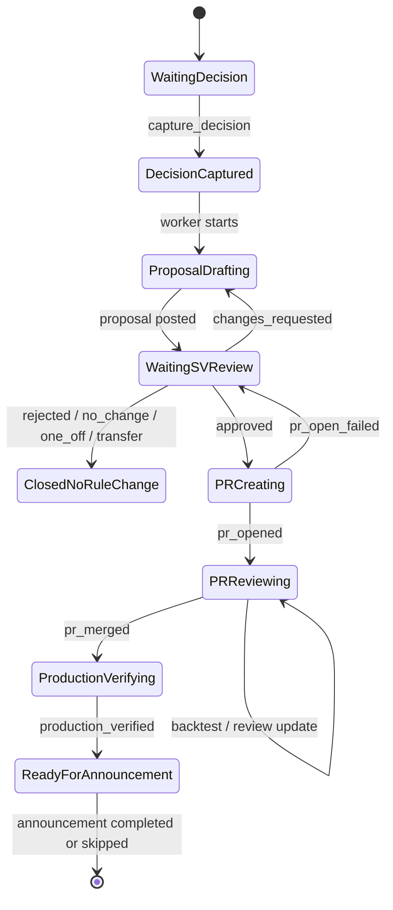

# Proposal & Delivery Contract

## 目的

`Proposal & Delivery Thread` に積む marker / event / checklist を、MVP 実装がそのまま読める契約として定義する。

この thread は、proposal approval で閉じない。
decision memo、rule proposal、SV approval、PR、backtest、CR、merge、本番反映確認までを同じ文脈で管理する。

## Thread Lifecycle



## Marker 原則

1. SV が実行を許可する操作は `SV_ACTION` または `SV_APPROVAL` で始まる。
2. worker / bot / agent の結果は `SV_ACTION_RESULT` または `SV_EVENT` で返す。
3. marker は 1 行で完結させる。
4. 人間向け本文と機械向け marker は同じ comment に置いてよい。
5. `id` / `action_id` は idempotency key として使う。
6. `target` は versioned object を指す。

## Target Naming

| Target | 意味 | 例 |
| --- | --- | --- |
| `slack_thread` | 同期済み Slack thread | `target=slack_thread` |
| `decision_memo:<version>` | decision memo | `target=decision_memo:v1` |
| `proposal:<version>` | rule proposal | `target=proposal:v1` |
| `pr:<number>` | GitHub PR | `target=pr:12345` |
| `backtest:<run_id>` | backtest run | `target=backtest:bt_20260605_001` |
| `announcement:<version>` | 周知文 draft | `target=announcement:v1` |
| `issue` | parent issue 全体 | `target=issue` |

## Resolution Types

`Recommended resolution` と close marker は同じ語彙を使う。

| Resolution | 意味 | PR |
| --- | --- | --- |
| `rule_change` | approval_rules の SSoT を更新する | 作る |
| `one_off_decision` | 今回だけの個別判断として閉じる | 作らない |
| `no_change` | 既存ルール / 運用で足りる | 作らない |
| `policy_pending` | 経理 / 顧客 / 社内方針待ち | 作らない |
| `transferred_product` | product / form / ops 側へ移管 | 作らない |

MVP では `rule_change` が主経路。
ただし、他 4 つの marker は最初から持つ。

## 1. Capture Decision

SV が Slack 相談を rule proposal 生成へ進める合図。
これは decision memo の承認ではない。

最小:

```md
[SV_ACTION id=act_20260605_001 type=capture_decision target=slack_thread status=requested]
```

resolution hint 付き:

```md
[SV_ACTION id=act_20260605_001 type=capture_decision target=slack_thread status=requested resolution_hint=rule_change]
```

worker が Event Log に返す:

```md
[SV_EVENT id=evt_20260605_001 type=capture_decision_detected status=done source=linear action_id=act_20260605_001]
```

worker が Proposal & Delivery Thread に返す:

```md
[SV_ACTION_RESULT id=act_20260605_001 status=done result=decision_memo_created target=decision_memo:v1]
```

失敗:

```md
[SV_ACTION_RESULT id=act_20260605_001 status=failed result=decision_memo_failed reason=<reason>]
```

## 2. Decision Memo Format

Decision memo は proposal 生成の中間成果物。
SV 承認は挟まない。
ただし、proposal review 時に根拠へ戻れるよう source URL を必須にする。

```md
## Decision Memo v1

### Source

- Slack thread: <slack_url>
- Linear issue: <linear_issue_url>
- Tenant: <tenant_id_or_key>

### Decision

<今回合意された業務判断>

### Scope

- Applies to: <対象>
- Does not apply to: <非対象>
- Time scope: <継続 / 暫定 / 今回のみ>

### Rule Impact

- Recommended resolution: rule_change
- Existing rule: <rule_id_or_unknown>
- Expected rule operation: add / update / remove / supplement

### Open Questions

- <未決があれば列挙。なければ None>

### Next

- Generate rule proposal

[SV_EVENT id=evt_20260605_002 type=decision_memo_posted status=done target=decision_memo:v1 source=agent]
```

## 3. Rule Proposal Format

SV が「この方針で PR 作成へ進めてよいか」を判断するための comment。

~~~md
## Rule Proposal v1

### Summary

<ルール変更案の要約>

### Source Decision

- Decision memo: decision_memo:v1
- Slack thread: <slack_url>

### Recommended Resolution

`rule_change`

### Affected Rules

| Rule | Current behavior | Proposed behavior |
| --- | --- | --- |
| <rule_id> | <現状> | <変更後> |

### Expected Diff

- File: `approval_rules/<tenant>/rules.json`
- Operation: add / update / remove
- Fields: <想定フィールド>

### Safety

- Scope: <適用範囲>
- Backtest expectation: <期待結果>
- Non-goals: <今回やらないこと>

### Risks

- <risk>

### SV Actions

```md
[SV_APPROVAL action_id=act_20260605_002 decision=approved target=proposal:v1 by=<sv>]
[SV_APPROVAL action_id=act_20260605_002 decision=changes_requested target=proposal:v1 by=<sv>]
[SV_APPROVAL action_id=act_20260605_002 decision=rejected target=proposal:v1 reason=<reason> by=<sv>]
```

[SV_EVENT id=evt_20260605_003 type=rule_proposal_posted status=done target=proposal:v1 source=agent]
~~~

## 4. Proposal Approval

`approved` は「ルール方針の承認」。
MVP では、方針承認後に PR open まで進んでよい。

```md
[SV_APPROVAL action_id=act_20260605_002 decision=approved target=proposal:v1 by=hirotea]
```

worker が検知:

```md
[SV_EVENT id=evt_20260605_004 type=proposal_approval_detected status=done source=linear action_id=act_20260605_002 target=proposal:v1]
```

PR 作成開始:

```md
[SV_EVENT id=evt_20260605_005 type=pr_create_requested status=done source=worker target=proposal:v1]
```

## 5. Changes Requested

SV は同じ Proposal & Delivery Thread に変更依頼を書く。
worker は issue context、decision memo、proposal v1、CR comment を読んで proposal v2 を作る。

```md
[SV_APPROVAL action_id=act_20260605_002 decision=changes_requested target=proposal:v1 by=hirotea]
```

worker event:

```md
[SV_EVENT id=evt_20260605_006 type=proposal_changes_requested_detected status=done source=linear target=proposal:v1]
[SV_ACTION_RESULT id=act_20260605_002 status=done result=proposal_revised target=proposal:v2]
```

## 6. Reject / Non Rule Change

proposal を拒否する場合は、`reason` に resolution type を入れる。

```md
[SV_APPROVAL action_id=act_20260605_002 decision=rejected target=proposal:v1 reason=one_off_decision by=hirotea]
```

または明示的 close action:

```md
[SV_ACTION id=act_20260605_003 type=close_as_one_off_decision target=issue status=requested]
[SV_ACTION id=act_20260605_004 type=close_as_no_change target=issue status=requested]
[SV_ACTION id=act_20260605_005 type=mark_policy_pending target=issue status=requested]
[SV_ACTION id=act_20260605_006 type=transfer_to_product_issue target=issue status=requested transfer_url=<url>]
```

worker result:

```md
[SV_ACTION_RESULT id=act_20260605_003 status=done result=issue_closed resolution=one_off_decision]
```

## 7. PR Open Result

PR 作成に成功しても Proposal & Delivery Thread は resolve しない。
同じ thread に PR URL を返す。

```md
[SV_ACTION_RESULT id=act_20260605_002 status=done result=pr_opened target=pr:12345 pr=<github_pr_url> branch=<branch_name>]
```

表示 checklist:

- [ ] PR linked
- [ ] Backtest completed
- [ ] Review comments addressed
- [ ] Merged
- [ ] Production verified

失敗:

```md
[SV_ACTION_RESULT id=act_20260605_002 status=failed result=pr_open_failed reason=<reason>]
```

失敗時の assignee は SV に戻す。

## 8. Backtest Result

```md
## Backtest Result

- Run: backtest:bt_20260605_001
- Command: `<command>`
- Result: pass / fail
- Summary: <summary>
- Risk: <risk_or_none>

[SV_EVENT id=evt_20260605_007 type=backtest_completed status=done target=backtest:bt_20260605_001 result=pass]
```

fail 時:

```md
[SV_EVENT id=evt_20260605_007 type=backtest_completed status=failed target=backtest:bt_20260605_001 result=fail reason=<reason>]
```

fail 時は自動 merge せず、assignee を SV に戻す。

## 9. PR Review / Merge / Production Verify

PR review の CR は GitHub 側で行われる。
worker は CR 対応結果を Proposal & Delivery Thread に戻す。

```md
[SV_EVENT id=evt_20260605_008 type=pr_review_update status=done target=pr:12345 state=changes_requested]
[SV_EVENT id=evt_20260605_009 type=pr_review_update status=done target=pr:12345 state=approved]
[SV_EVENT id=evt_20260605_010 type=pr_merged status=done target=pr:12345 merge_sha=<sha>]
[SV_EVENT id=evt_20260605_011 type=production_verified status=done target=pr:12345 version=<rule_version>]
```

Production verification 失敗:

```md
[SV_EVENT id=evt_20260605_011 type=production_verified status=failed target=pr:12345 reason=<reason>]
```

## 10. Ready For Announcement

本番反映確認が完了したら、Announcement Thread を作るか更新する。

Proposal & Delivery Thread には次を返す:

```md
[SV_EVENT id=evt_20260605_012 type=ready_for_announcement status=done source=worker target=announcement:v1]
```

Proposal & Delivery Thread の resolve はまだしない。
Announcement posted / skipped まで待つ。

## Minimal Parser Contract

MVP worker は次だけ読めればよい。

| Marker | Trigger |
| --- | --- |
| `SV_ACTION type=capture_decision` | decision memo / proposal 生成開始 |
| `SV_APPROVAL decision=approved target=proposal:*` | PR 作成開始 |
| `SV_APPROVAL decision=changes_requested target=proposal:*` | proposal 再生成 |
| `SV_APPROVAL decision=rejected target=proposal:*` | rule proposal なしで close / wait |
| `SV_ACTION type=close_as_one_off_decision` | one-off close |
| `SV_ACTION type=close_as_no_change` | no-change close |
| `SV_ACTION type=mark_policy_pending` | waiting 状態へ戻す |
| `SV_ACTION type=transfer_to_product_issue` | 移管 close |

## Open Questions

- `action_id` を proposal comment 作成時に agent が採番するか、SV の Chrome extension が採番するか
- `by=<sv>` は Linear user id にするか、display name にするか
- `reason` / `resolution` は enum としてどこで validation するか
- PR review update を GitHub webhook で拾うか、local worker polling にするか
