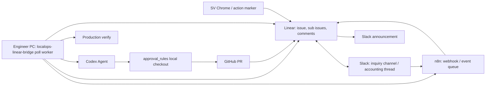

# SV Terminal MVP System / Event Mermaid

## ロゴ入り構成図

```mermaid
%%{init: {"securityLevel":"loose","flowchart":{"htmlLabels":true},"theme":"base","themeVariables":{"fontFamily":"Inter, ui-sans-serif","primaryColor":"#ffffff","primaryBorderColor":"#d0d7de","lineColor":"#64748b"}}}%%
flowchart LR
  classDef human fill:#fff7ed,stroke:#fb923c,stroke-width:1px,color:#111827;
  classDef product fill:#ffffff,stroke:#cbd5e1,stroke-width:1px,color:#111827;
  classDef queue fill:#ecfeff,stroke:#06b6d4,stroke-width:1px,color:#111827;
  classDef local fill:#f0fdf4,stroke:#22c55e,stroke-width:1px,color:#111827;
  classDef repo fill:#f8fafc,stroke:#64748b,stroke-width:1px,color:#111827;
  classDef optional fill:#f8fafc,stroke:#94a3b8,stroke-dasharray: 6 4,color:#475569;

  subgraph SVSide["SV side"]
    SV["<div><img src='https://cdn.simpleicons.org/googlechrome/4285F4' width='30'/><br/><b>SV Chrome</b><br/>👩‍✈️ action marker / approval</div>"]:::human
    Slack["<div><img src='https://cdn.simpleicons.org/slack/4A154B' width='30'/><br/><b>Slack</b><br/>問い合わせ専用channel<br/>経理相談thread</div>"]:::product
  end

  subgraph ControlPlane["Control plane"]
    Linear["<div><img src='https://cdn.simpleicons.org/linear/5E6AD2' width='30'/><br/><b>Linear</b><br/>SV Ops private team<br/>tenant Project / parent issue / sub issues</div>"]:::product
    EventLog["<div><img src='https://cdn.simpleicons.org/linear/5E6AD2' width='24'/><br/><b>Event Log Thread</b><br/>SV_EVENT / SV_ACTION_RESULT</div>"]:::product
    N8N["<div><img src='https://cdn.simpleicons.org/n8n/EA4B71' width='30'/><br/><b>n8n</b><br/>Webhook / routing / audit</div>"]:::queue
    Queue["<div><img src='https://cdn.simpleicons.org/n8n/EA4B71' width='24'/><br/><b>Event Queue</b><br/>n8n Data Table<br/>queued / claimed / done</div>"]:::queue
  end

  subgraph EngineerSide["Engineer side"]
    PC["<div><span style='font-size:30px'>🧑‍💻</span><br/><b>Engineer PC</b><br/>localops-linear-bridge<br/>poll worker, outbound only</div>"]:::local
    Codex["<div><span style='font-size:30px'>🤖</span><br/><b>Codex Agent</b><br/>rules.json edit / PR body / resume</div>"]:::local
    Rules["<div><span style='font-size:28px'>📁</span><br/><b>approval_rules</b><br/>local checkout / worktree<br/>rules.json / backtest</div>"]:::repo
  end

  subgraph Delivery["Delivery"]
    GitHub["<div><img src='https://cdn.simpleicons.org/github/181717' width='30'/><br/><b>GitHub</b><br/>PR / review / merge</div>"]:::product
    Prod["<div><span style='font-size:28px'>🚀</span><br/><b>Production</b><br/>rule version / smoke verify</div>"]:::repo
  end

  Sheet["<div><span style='font-size:28px'>📊</span><br/><b>Google Sheet</b><br/>backup queue only</div>"]:::optional

  Slack -- "1. new inquiry message" --> N8N
  N8N -- "2. create issue / sub issues / labels" --> Linear
  N8N -- "3. append event" --> Queue
  Linear -- "4. official Slack sync thread" <--> Slack
  Linear -- "5. create event log comment" --> EventLog
  SV -- "6. insert SV_ACTION marker / approve" --> Linear
  SV -- "optional explicit event" --> N8N
  PC -- "7. poll n8n API<br/>(no inbound port)" --> Queue
  PC -- "8. fetch issue, comments, attachments" --> Linear
  PC -- "9. run / resume" --> Codex
  Codex -- "10. edit + test" --> Rules
  Rules -- "11. create PR via gh" --> GitHub
  GitHub -- "12. PR link / review status" --> Linear
  GitHub -- "13. merged" --> PC
  PC -- "14. verify production" --> Prod
  PC -- "15. result / PR / verify log" --> EventLog
  PC -- "16. announcement draft / post request" --> Linear
  Linear -- "17. announcement via official sync / bot" --> Slack
  N8N -. "backup append" .-> Sheet
  PC -. "backup poll" .-> Sheet
```

## MVP1: Slack 問い合わせからルール反映まで

```mermaid
%%{init: {"securityLevel":"loose","flowchart":{"htmlLabels":true},"theme":"base","themeVariables":{"fontFamily":"Inter, ui-sans-serif","lineColor":"#64748b"}}}%%
flowchart TD
  classDef human fill:#fff7ed,stroke:#fb923c,color:#111827;
  classDef product fill:#ffffff,stroke:#cbd5e1,color:#111827;
  classDef worker fill:#f0fdf4,stroke:#22c55e,color:#111827;
  classDef queue fill:#ecfeff,stroke:#06b6d4,color:#111827;
  classDef gate fill:#fef9c3,stroke:#eab308,color:#111827;

  S1["<img src='https://cdn.simpleicons.org/slack/4A154B' width='24'/><br/><b>Slack</b><br/>SV starts inquiry in dedicated channel"]:::product
  N1["<img src='https://cdn.simpleicons.org/n8n/EA4B71' width='24'/><br/><b>n8n</b><br/>Slack event -> issue bootstrap"]:::queue
  L1["<img src='https://cdn.simpleicons.org/linear/5E6AD2' width='24'/><br/><b>Linear parent issue</b><br/>Project=tenant, labels, sub issues, Event Log"]:::product
  L2["<img src='https://cdn.simpleicons.org/linear/5E6AD2' width='24'/><br/><b>Slack sync thread</b><br/>経理相談がLinearに蓄積"]:::product
  SV1["<img src='https://cdn.simpleicons.org/googlechrome/4285F4' width='24'/><br/>👩‍✈️ <b>SV</b><br/>Decision captured<br/>SV_ACTION marker"]:::human
  Q1["<img src='https://cdn.simpleicons.org/n8n/EA4B71' width='24'/><br/><b>n8n Queue</b><br/>capture_decision / needs_rule_draft"]:::queue
  W1["🧑‍💻<br/><b>Local worker</b><br/>poll queue + fetch Linear context"]:::worker
  A1["🤖<br/><b>Codex Agent</b><br/>rule proposal draft"]:::worker
  G1["<b>Approval Gate</b><br/>SV approve / CR / reject<br/>in Linear comment thread"]:::gate
  PR1["<img src='https://cdn.simpleicons.org/github/181717' width='24'/><br/><b>GitHub PR</b><br/>rules.json diff / backtest result"]:::product
  M1["<img src='https://cdn.simpleicons.org/github/181717' width='24'/><br/><b>Review + Merge</b><br/>Linear Diffs / GitHub review"]:::product
  V1["🧑‍💻<br/><b>Local worker</b><br/>production rule verify"]:::worker
  A2["<img src='https://cdn.simpleicons.org/slack/4A154B' width='24'/><br/><b>Slack announcement</b><br/>official sync / bot account"]:::product
  D1["<img src='https://cdn.simpleicons.org/linear/5E6AD2' width='24'/><br/><b>Linear Done</b><br/>all phase sub issues closed"]:::product

  S1 --> N1 --> L1 --> L2 --> SV1 --> Q1
  Q1 --> W1 --> A1 --> G1
  G1 -- "approved" --> PR1 --> M1 --> V1 --> A2 --> D1
  G1 -- "CR" --> A1
  G1 -- "reject / one-off" --> D1
```

## MVP2: 性能低下アラートからルール修正まで

```mermaid
%%{init: {"securityLevel":"loose","flowchart":{"htmlLabels":true},"theme":"base","themeVariables":{"fontFamily":"Inter, ui-sans-serif","lineColor":"#64748b"}}}%%
flowchart TD
  classDef human fill:#fff7ed,stroke:#fb923c,color:#111827;
  classDef product fill:#ffffff,stroke:#cbd5e1,color:#111827;
  classDef worker fill:#f0fdf4,stroke:#22c55e,color:#111827;
  classDef queue fill:#ecfeff,stroke:#06b6d4,color:#111827;
  classDef gate fill:#fef9c3,stroke:#eab308,color:#111827;

  D0["🧪<br/><b>Dummy alert</b><br/>bad feedback threshold event"]:::worker
  N0["<img src='https://cdn.simpleicons.org/n8n/EA4B71' width='24'/><br/><b>n8n Queue</b><br/>rule_performance_alert"]:::queue
  W0["🧑‍💻<br/><b>Local worker</b><br/>poll alert + create Linear issue"]:::worker
  L0["<img src='https://cdn.simpleicons.org/linear/5E6AD2' width='24'/><br/><b>Linear parent issue</b><br/>trigger:rule-performance-alert<br/>assignee=agent"]:::product
  E0["🤖<br/><b>Agent</b><br/>collect evidence / diagnose affected rule"]:::worker
  P0["🤖<br/><b>Proposal</b><br/>fix plan + optional draft PR"]:::worker
  G0["<b>Approval Gate</b><br/>SV approve / CR / reject"]:::gate
  PR0["<img src='https://cdn.simpleicons.org/github/181717' width='24'/><br/><b>GitHub PR</b><br/>rules.json diff / backtest"]:::product
  M0["<img src='https://cdn.simpleicons.org/github/181717' width='24'/><br/><b>Review + Merge</b>"]:::product
  V0["🧑‍💻<br/><b>Local worker</b><br/>production verify"]:::worker
  S0["<img src='https://cdn.simpleicons.org/slack/4A154B' width='24'/><br/><b>Slack announcement</b><br/>rule change declaration"]:::product
  Done["<img src='https://cdn.simpleicons.org/linear/5E6AD2' width='24'/><br/><b>Linear Done</b>"]:::product

  D0 --> N0 --> W0 --> L0 --> E0 --> P0 --> G0
  G0 -- "approved" --> PR0 --> M0 --> V0 --> S0 --> Done
  G0 -- "CR" --> P0
  G0 -- "reject / no-change" --> Done
```

## フォールバック版

外部画像の読み込みや HTML label が無効な環境では、次の簡易版を使う。

```mermaid
flowchart LR
  SV["SV Chrome / action marker"] --> Linear["Linear: issue, sub issues, comments"]
  Slack["Slack: inquiry channel / accounting thread"] --> N8N["n8n: webhook / event queue"]
  N8N --> Linear
  Linear <--> Slack
  Worker["Engineer PC: localops-linear-bridge poll worker"] --> N8N
  Worker --> Linear
  Worker --> Codex["Codex Agent"]
  Codex --> Rules["approval_rules local checkout"]
  Rules --> GitHub["GitHub PR"]
  GitHub --> Linear
  Worker --> Prod["Production verify"]
  Worker --> Linear
  Linear --> SlackAnnounce["Slack announcement"]
```

